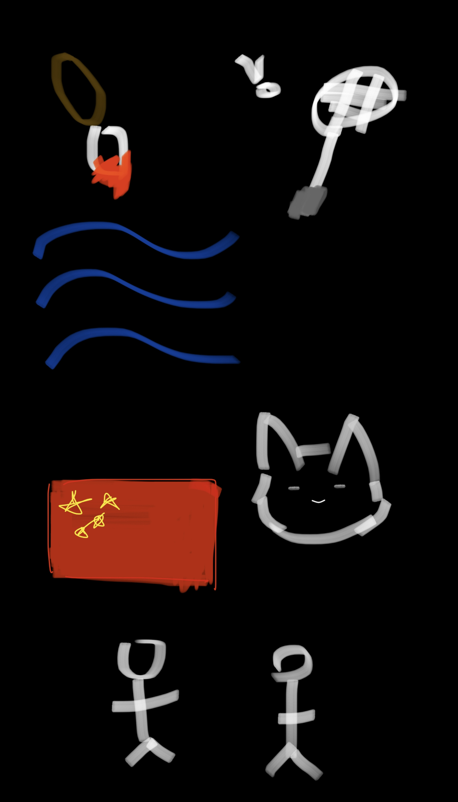
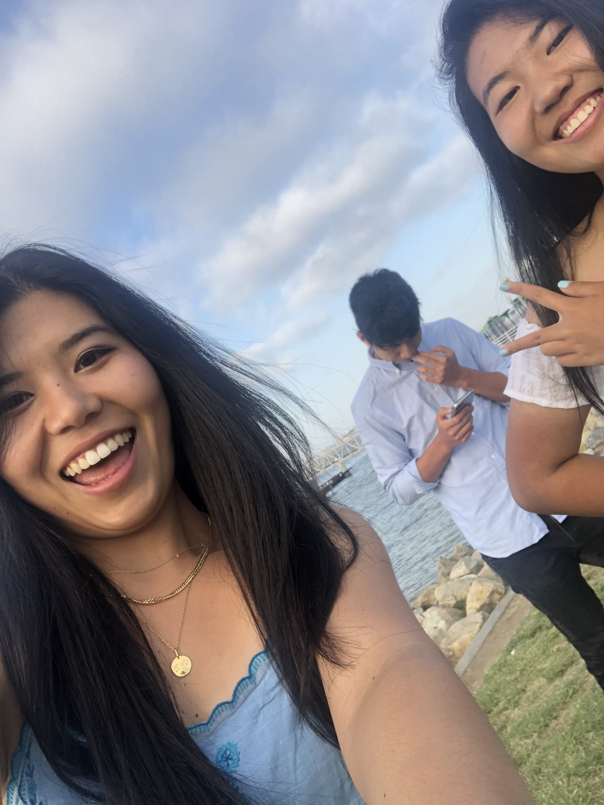

<a style="color:#4263C6" href="#About">About Me</a>
 
<a style="color:#4263C6" href="#Family">Family</a>
 
<a style="color:#4263C6" href="#Class">Classes</a>

<h1 style="text-align: center; color:#001861;font-weight:700; font-size:40px">Lindsay's Blog</h1>

Welcome to my page! Here you'll get to learn a bit more about me and my life.

<section ID="About"></section>
<h1 style="text-align: center; color: #324FA3;font-weight:600;font-size:30px">About Me</h1>

    To the left is a drawing of some things I love. At the very top left, there is a paintbrush with red paint on it. I really like art, and I love to draw and paint both on paper and digitally. To the right of that, there is a badminton raquet because I have recently picked up the sport. My friend invited me to a badminton Discord server that was hosting weekly meet ups to play badminton, so I started getting into it. Below the paintbrush is a drawing of water or waves. I really love the ocean, I think it's so peaceful and calming. I love to listen to the waves while I reflect about life. Below the waves is a Chinese flag, a symbol for my ethnicity. My mom and dad are both from mainland China so I am 100% Chinese. To the right of the flag is a drawing of my cat, Maomao. I love Maomao, as he has always been by my side and comforting me through the hard times. He also loves to snuggle with me in bed and I think that is the cutest thing. At the very bottom of the picture is a drawing of my two siblings. I have two older siblings, Jennifer and Alan.
     
     
     
     
     

<section ID="Family"></section>
<h1 style="text-align: center; color: #324FA3;font-weight:600;font-size:30px">My Family</h1>

As I mentioned before, I have two siblings. Jennifer is the olest sibling (she's the one standing to the left). She attended Mount Carmel High School and went to UC Berkeley for college. She double majored in computer science and econ. Now, she works as a data analyst for the startup company, Nextdoor. Alan is the second oldest (the one standing in the back). He attended Del Norte High School and went to Brown University for college. There, he majored in somputer science as well. Now, he is an investment banker and works for a small firm. My mom and dad are sadly not in the picture. They attended Zhejiang University, a highly respected college in China. But when my mom came to the United States, she also went to Ohio University to major in computer science. Now, my dad works at Broadcom and my mom works for WFG. As well, Maomao and Blssom are also very important members of my family. Maomao is a  11 year short-haired tuxedo cat who loves to sleep. Everyday when I come home from school, I'll find him curled up on either his bed or my bed, fast asleep. The other cat in the family, Blossom, is a new addition to the family. My sister adopted Blossom earlier this year in May. She's a 1 year old long-haired grey tabby who is very playful. Blossom can never stay still long enough for you to pet her, she always has to be on the move. Maybe she will come up to you for a few seconds to nuzzle your leg but she's most likley gone within the next minute. 

<section ID="Class"></section>
<h1 style="text-align: center; color: #324FA3;font-weight:600;font-size:30px">Classes Trimester 1</h1>
Period 1: AP Calc BC with Mrs. Lanzi
 
Period 2: AP Physics with Mr. Liao
 
Period 3: AP English Language with Mrs. Darcey
 
Period 4: AP Comp Sci P
 
Period 5: AP Offrole